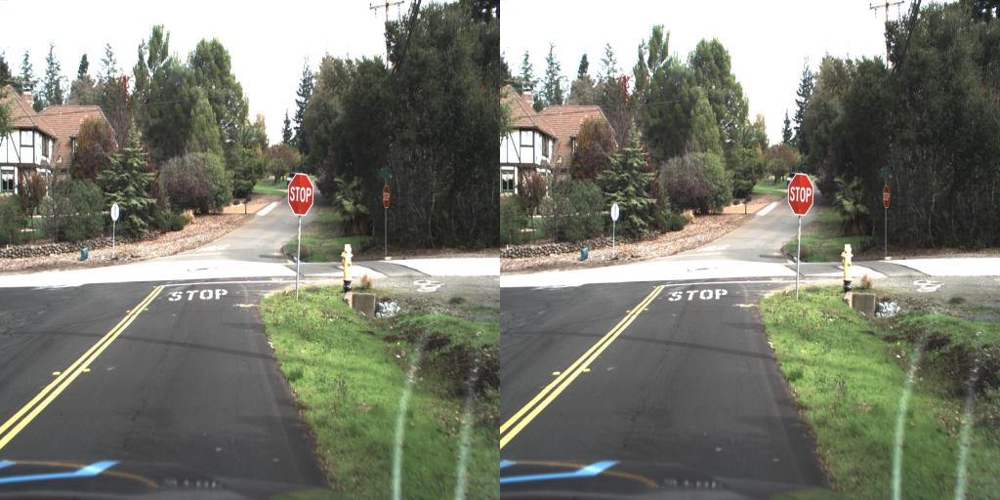

# Automotive object detection via a SSD model built from scratch
In this project, the single shot multibox detector (SSD) model of W. Liu, et al. (see [here](https://link.springer.com/chapter/10.1007/978-3-319-46448-0_2)) is constructed from scratch, with minor modifications. This model is trained and tested on an automotive focused dataset and a website has been created where users can upload images to see the model's predictions, see [here](https://ssd-demo-app-884945419812.us-central1.run.app/).

A high level explanation of how the model works is given in [SSD_explained.ipynb](/SSD_explained.ipynb).

For instructions on using this repo yourself, see [GettingStarted.md](/GettingStarted.md).

<!--
## Model Architecture
SSD is a feed-forward convolutional neural network.  The early layers of the model are the well known VGG-16 network (see [here](https://ieeexplore.ieee.org/document/7486599)).

In the above figure (from the paper of W. Liu, et al.), we can see the architecture of the SSD model.
Many advances have been made since the introduction of SSD.
Two such improvements have been implemented in the model here.  First, batch norms now follow most of the convolution layers, and, second, intersection over union (IoU) based non-maximum supression is upgraded to complete IoU based non-maximum supression.
The constuction in this project (see [here](/SSD_from_scratch.py)) is not elegant, as the intent is to show model architecture for educational purposes.  A cleaner implementation by Max deGroot can be found [here](https://github.com/amdegroot/ssd.pytorch/blob/master/ssd.py).
-->

## Dataset
The [dataset](https://www.kaggle.com/datasets/sshikamaru/udacity-self-driving-car-dataset), originally compiled by Udacity, contains 29,800 images with 194,539 bounding boxes with classification labels.  Two such examples are below.

Unfortunately, there are some flaws with the dataset, as seen below.

In the first image, two of the traffic lights are labeled twice and in the second image, a house is labeled as a truck.  These labeling mistakes are present throughout the dataset but occur infrequently.  See file [EDA_car.ipynb](/EDA_car.ipynb) for exploratory data analysis.

<!--
## Custom Image Class
The `ImageClass` dataset of [CarImageClass.py](/CarImageClass.py) wraps training images and COCO/VOC-style annotations into a PyTorch `Dataset` that works cleanly with torchvision v2 transforms and detection models. It scans a target directory for `.jpg` files and a single `.csv` annotation file, builds a `class_to_idx` mapping, and groups rows by filename so each index returns one image and all of its boxes. For a given index, it decodes the image, looks up the corresponding rows, and returns `(img, target)` where `img` is a CHW tensor and `target` is a dict with `boxes` as `tv_tensors.BoundingBoxes` in absolute `xyxy` pixels, `labels` as integer class indices, `image_id`, and optionally per-box `areas` computed after any geometric transforms. The constructor supports sub-sampling via `file_pct` and a fixed `rand_seed`, and the helper `make_train_test_split` builds stratified, group-wise train/test splits by filename so that images from the same file never appear in both sets. A visualization method, `show_with_box`, can overlay both ground-truth and predicted boxes (in several coordinate conventions) on the decoded image, which is useful for quickly inspecting annotation quality and model outputs.
-->

## Preprocessing
This project includes a preprocessing pipeline to turn the self-driving car [dataset](https://www.kaggle.com/datasets/sshikamaru/udacity-self-driving-car-dataset) into a clean SSD training set. Starting from the _annotations.csv file (included in the dataset download), all traffic-light subclasses (e.g. trafficLight-Green, trafficLight-RedLeft, etc.) are collapsed into a single trafficLight class, simplifying the label space. Images that appear in the raw export folder but have no bounding-box annotations are explicitly added as “empty” background examples, so the model sees both object-rich and purely background frames during training. The combined annotation table is then split into train and test using StratifiedGroupKFold, stratifying on class labels while grouping by filename to prevent any image from appearing in both splits, and the corresponding images and CSV annotation files are written into separate train/ and test/ directories for downstream training.  See the [preprocessing_car.ipynb](/preprocessing_car.ipynb) notebook for details and/or to perform these steps yourself.

## Model training
Each training image is passed through a torchvision v2 transform pipeline that converts it to a float32 tensor, then applies a size-aware IoU-based random crop (`ConditionalIoUCrop`) which chooses between two `RandomIoUCrop` policies depending on whether the image contains large or only small objects, so that small targets are more likely to be zoomed in on. This is followed by bounding-box sanitization, random horizontal flips, and random photometric distortion for geometric and color augmentation, before finally resizing to 300×300 and normalizing with ImageNet mean and standard deviation to match the SSD backbone’s expected input distribution.

The SSD detector is trained end-to-end with a standard localization + classification objective and hard negative mining. For each batch, the model predicts localization offsets and class logits for all 8,732 priors; these are matched to ground-truth boxes using an IoU-style overlap, and only matched priors are treated as positives. The localization loss is Smooth L1 on the encoded offsets for positive priors, normalized by the number of positives. The classification loss is a cross-entropy over all classes (including background), but it is computed on all positive priors plus a subset of the hardest negatives: for each image, negative priors are ranked by their per-prior CE loss and only the top-k are kept, with a configurable negative-to-positive ratio (e.g. 3:1). This focuses learning on informative background examples and prevents easy negatives from dominating the gradients. During evaluation, the same target-building and loss computation are reused, and detection quality is measured via torchmetrics `MeanAveragePrecision` at IoU=0.5 (mAP@0.50), using the model’s own `predict` method for decoding and NMS. 

Optimization uses SGD with Nesterov momentum and weight decay, together with a cosine learning-rate schedule with linear warmup, see learning-rate vs. epoch plot below for an example with 150 epochs (which was used for model training).

The helper `build_optimizer_and_scheduler` builds an SGD optimizer (chosen values: base LR 3e-3, momentum 0.9, weight decay 5e-4) and a `LambdaLR` scheduler that first linearly increases the learning rate from 0 to the base LR over a specified number of warmup epochs, then decays it following a cosine curve down to a minimum LR (chosen value: 1e-6) over the remaining training steps. The scheduler is designed to be stepped once per optimizer step (per mini-batch), and the training loop optionally supports stepping per batch or per epoch depending on the `sched_step_w_opt` flag. The trainer also supports early stopping based on validation mAP, periodic and “best” checkpoint saving (including optimizer/scheduler state and RNG state), and utility functions to merge and plot loss/mAP curves across multiple training runs.

Models were trained for 150 epochs with the previously described optimizer and schuduler using [SSD_model_train.ipynb](/SSD_model_train.ipynb).

## Results
Three models were trained for 150 epochs with the optimizer and schuduler previously described.  The first model (named "Zoom out, no bootstrap") was trained with an additional image transformation, `RandomZoomOut`.  The second model (named "No zoom out, no bootstrap") was trained with no additional augmentations.  The final model (named "No zoom out, bootstrap") had the training set “bootstrapped” by oversampling image filenames according to how many objects they contain: images with 0 objects are used once, those with 1–2 objects are duplicated, those with 3–6, 7–9, and ≥10 objects are repeated 3, 4, and 5 times respectively in the `file_list`. This weighted duplication increases the effective number of training samples and biases each epoch toward images with richer annotations, without fabricating any synthetic labels.  The training loss/mAP@0.50 information per epoch for the top performing model is below.  The mAP subplot is mAP@0.50 evaluated on the validation set per epoch.

The mAP@0.50, along with individual class mAP@0.50, on the test set are reported in the table below.

| Model    | mAP@0.50 | biker | car | pedestrian | traffic light | truck |
| :------: | :------: | :------: | :------: | :------: | :------: | :------: |
| Zoom out, no bootstrap     | 0.4613 | 0.2854 | 0.6618 | 0.2145 | 0.5571 | 0.5875 |
| No zoom out, no bootstrap  | 0.4724 | 0.3015 | 0.6681 | 0.2314 | 0.5619 | 0.5992 |
| No zoom out, bootstrap     | 0.5292 | 0.4045 | 0.7088 | 0.2907 | 0.5956 | 0.6465 |

Since the vast majority of objects in the dataset are small compared to the image size, it is not a surprise that the `RandomZoomOut` transformation degrades model performance.  Enlarging the training dataset via the "bootstrapping" method significantly improved model performance.

## Website App
This repository includes an interactive web demo of the SSD model ([link](https://ssd-demo-app-884945419812.us-central1.run.app/)). When a user uploads an image through the browser, the FastAPI backend loads the trained `mySSD` model (biker, car, pedestrian, traffic light, and truck classes, trained on daytime dashcam footage) and calls the model’s `show_prediction_side_by_side` method to generate a visualization. The method preprocesses the uploaded image, runs a forward pass through the detector, and returns a single PNG where the left panel is the original image (resized with preserved aspect ratio) and the right panel overlays the predicted bounding boxes and class labels. The resulting side-by-side image is streamed back directly to the client so users can quickly inspect how the model interprets their own images.

The files for the web demo are located in the [app_files](/app_files/) folder.

The images below are from the website.  The left image is user uploaded and the right image contains the model predictions.

